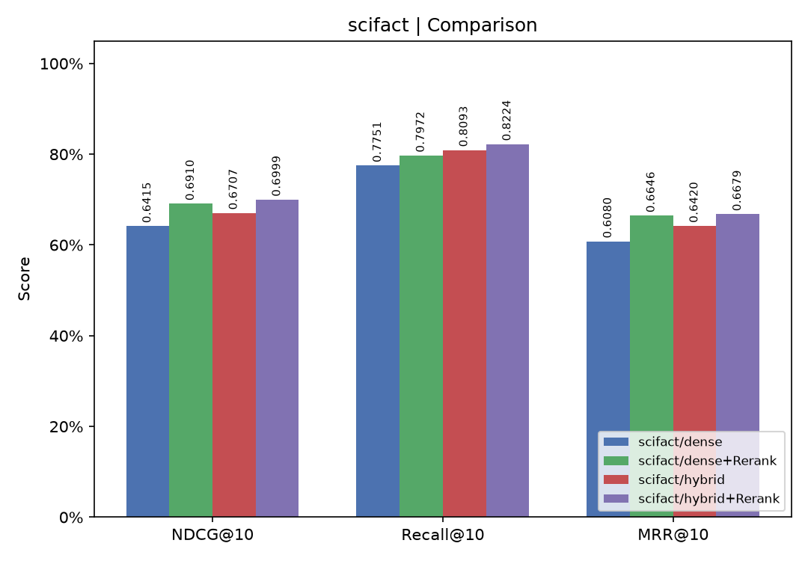

# RAG Service

基于 FastAPI 的 RAG（Retrieval-Augmented Generation）服务，包含知识库（KnowledgeBase）和记忆库（MemoryBank）两种向量存储。项目支持 Qdrant 向量库、Embedding 服务、Rerank 服务及 BEIR 数据集评测。

## 目录结构

- `main.py` - 启动 RAG API 服务
- `mcp_svr.py` - 启动 MCP Server
- `conf/conf.yaml` - 服务配置
- `engine/` - 核心业务逻辑：知识库、记忆库、管道、chunker
- `eval/` - 评测与数据集导入工具
  - `eval/lihua/` - LiHua-World 长上下文多跳检索端到端评测（评测框架 + 结果；数据集为公开语料不入库，见下方说明）
- `vector_store/qdrant.py` - Qdrant 封装
- `scripts/run.sh` - 统一启动/停止/状态管理脚本
- `data/` - 评测结果与生成文件输出目录
- `models/` - 本地模型文件

## 快速开始

> 以下命令均在**项目根目录**下执行（项目根目录即 `rag` 包的根，`main.py`、`scripts/`、`eval/` 等都在此目录下）。

### 1. 安装依赖

```bash
python -m venv .venv
source .venv/bin/activate
pip install -e .
```

> 项目依赖定义在 `pyproject.toml`，包括 `fastapi`、`qdrant-client`、`httpx`、`beir`、`matplotlib` 等。

### 2. 启动服务

使用项目自带管理脚本：

```bash
./scripts/run.sh start
```

可选参数：

- `./scripts/run.sh start api`：仅启动 API 服务及依赖服务
- `./scripts/run.sh start mcp`：仅启动 MCP 服务及依赖服务
- `./scripts/run.sh stop`：停止所有服务
- `./scripts/run.sh status`：查看各服务运行状态

### 3. API 地址

- RAG API: `http://localhost:8001`
- MCP Server: `http://localhost:9000`
- Embedding 服务: `http://localhost:8002`
- Rerank 服务: `http://localhost:8003`

## 使用说明

### 创建/列出知识库

- 创建 collection：

```bash
curl -X POST http://localhost:8001/knowledge \
  -H "Content-Type: application/json" \
  -d '{"name":"scifact","enabled":true,"hybrid":true}'
```

- 列出 collection：

```bash
curl http://localhost:8001/knowledge
```

### 导入文档 / BEIR 数据集

直接调用导入脚本（`rag` 包即项目根目录本身，`python -m rag.*` 需在项目根下把**上一级**目录加入搜索路径）：

```bash
source .venv/bin/activate
PYTHONPATH=.. python -m rag.eval.ingest <source-path> -c <collection>
```

导入 BEIR 数据集：

```bash
python -m rag.eval.ingest --dataset-name scifact -c scifact
```

### 检索查询

发送 search 请求：

```bash
curl -X POST http://localhost:8001/knowledge/search \
  -H "Content-Type: application/json" \
  -d '{
    "collection": "scifact",
    "queries": ["your query text"],
    "top_k": 10,
    "threshold": 0.0,
    "search_type": "dense",
    "rerank": false
  }'
```

## 评测

项目基于 [BEIR](https://github.com/beir-cellar/beir) 评测流程。示例（在项目根目录下）：

```bash
source .venv/bin/activate
PYTHONPATH=.. python -m rag.eval eval --dataset-name scifact --collection scifact
```

这会生成 JSON 报告文件到 `data/`，默认文件名类似：

- `scifact_scifact_dense_no_rerank_<timestamp>.json`
- `scifact_scifact_dense_rerank_<timestamp>.json`
- `scifact_scifact_hybrid_no_rerank_<timestamp>.json`
- `scifact_scifact_hybrid_rerank_<timestamp>.json`

### 绘图

评测完成后，可使用 plot 功能生成对比图：

```bash
source .venv/bin/activate
PYTHONPATH=.. python -m rag.eval plot data/<report1>.json data/<report2>.json ...
```

生成的 PNG 文件会保存到 `data/`。

### 评测结果（SciFact，300 查询 / 5183 文档）

各检索配置在 SciFact 数据集上的指标：

| 配置 | NDCG@1 | NDCG@10 | MAP@10 | Recall@10 | MRR@10 | NDCG@100 | Recall@100 |
| --- | ---: | ---: | ---: | ---: | ---: | ---: | ---: |
| dense（无重排） | 0.5100 | 0.6415 | 0.5920 | 0.7751 | 0.6080 | 0.6706 | 0.9037 |
| dense + rerank | 0.5633 | 0.6910 | 0.6508 | 0.7972 | 0.6646 | 0.7141 | 0.9137 |
| hybrid（无重排） | 0.5100 | 0.6707 | 0.6200 | 0.8093 | 0.6420 | 0.6991 | 0.9303 |
| hybrid + rerank | 0.5667 | 0.6999 | 0.6547 | 0.8224 | 0.6679 | 0.7136 | 0.9270 |

检索对比图：



> 小结：rerank 明显提升 precision 类指标（NDCG@1 / MAP@1）；hybrid 在召回率（Recall@10 / Recall@100）上优于纯 dense。

### 评测结果（LiHua-World 端到端评测，Agent 多轮检索）

除单次检索的 BEIR 式评测外，项目还实现了 **LLM-Agent 驱动的端到端检索评测**（`eval/lihua/`），验证"LLM 自主规划查询 → 调用 RAG MCP 工具 → 多轮收敛 → 生成答案"的完整链路。

**评测场景（LiHua-World）**：基于公开 [LiHua-World](https://github.com/HKUDS/MiniRAG/tree/main/dataset/LiHua-World) 数据集的**长上下文时序型**检索场景——442 段通讯对话覆盖 52 周时间线（含业务往来、生活备忘等多主题），问题需跨会话、跨时间定位证据。query_set 全量 637 题按证据类型分布：

| 类型 | 题数 | 说明 |
| --- | ---: | --- |
| Single | 506 | 证据在同一段会话内 |
| Multi | 66 | 需跨多段会话拼接证据 |
| Null | 65 | 知识库无答案，应拒答 |

> 数据集为公开语料（[HKUDS/MiniRAG](https://github.com/HKUDS/MiniRAG)，ACL 2026），不随仓库分发。运行评测前请将 `processed.jsonl`、`query_set.json` 及会话 txt 放置到 `eval/lihua/dataset/`（含 `week*/` 等子目录），目录结构见 `eval/lihua/dataset.py` 顶部说明。

**评测方式**：Agent 模式由 LLM 自主决定查询策略（改写/拆解/追问）并循环调用 MCP `search` 工具，证据覆盖后自行收敛输出答案，再由 LLM 从五个维度打 1-5 分；Direct 模式为对照基线（问题原样单次检索 top-5，不产答案）。**本次评测仅跑 query_set 全量 637 题的 1/10 抽样子集（seed=42、ratio=0.1，共 64 题）**，agent 与基线用**同一 64 题子集**保证可比；以下 Agent 结果均基于该 1/10 子集，不代表全量结论。

**运行命令**（项目根目录下，需先启动服务）：

```bash
source .venv/bin/activate
# Agent 多轮检索评测（可 --qids 0,1.. / --types Multi / --max-rounds 调整）
PYTHONPATH=.. python -m rag.eval.lihua -c lihua --mode agent \
  --sample-ratio 0.1 --sample-seed 42 --output lihua_agent_sample01
# Direct 基线（同题集对照）
PYTHONPATH=.. python -m rag.eval.lihua -c lihua --mode direct \
  --top-k 5 --output lihua_direct_top5
```

**检索结果（Agent vs Direct 基线，同一 64 题子集 = query_set 全量的 1/10）**：

| 指标 | Direct（单轮 top-5） | Agent（多轮） |
| --- | ---: | ---: |
| 证据累积召回率 | 76.72% | **88.36%** |
| 首轮召回率 | 76.72% | 79.31% |
| 全题证据召齐全率（full recall rate） | 65.62% | **78.12%** |
| 平均检索轮次 | 1.0 | 2.34 |
| 平均查询数 | 1.0 | 9.69 |
| 冗余调用/题 | 0 | 0.20 |
| 错误率 | 0% | 0% |

Agent 通过多轮检索把证据累积召回率从基线的 76.7% 提升到 **88.4%（+11.7pp）**，全题召齐全率提升 **12.5pp**；平均仅需 2.3 轮即收敛，冗余调用接近 0。（以上均为 1/10 抽样子集 64 题上的结果）

**LLM 五维裁判评分（1-5，Agent 模式，1/10 子集 64 题）**：

| 维度 | 均分 |
| --- | ---: |
| answer_correctness（答案正确性） | 3.84 |
| evidence_recall（证据覆盖） | 4.53 |
| groundedness（回答有据性） | 4.23 |
| query_quality（查询质量） | 3.73 |
| retrieval_efficiency（检索效率） | 3.00 |
| **overall mean** | **3.87** |

**拒答（abstention，1/10 子集 64 题内）**：整体 abstain 率 29.7%，其中 Null 类（知识库无答案）问题全部正确拒答，可有效降低幻觉风险。

原始轨迹与报告见 `eval/lihua/results/`：

- `lihua_agent_sample01_report.json` / `.jsonl` — Agent 1/10 抽样 64 题评测报告与逐题轨迹
- `lihua_direct_top5_report.json` — Direct 全量 637 题基线报告（非 1/10 抽样，仅作语料整体基线参考）
- `lihua_direct_top5_sample01_agg.json` — 同 1/10 子集（64 题）Direct 对照聚合，用于与 Agent 逐项对比

## 运行环境

- Python 3.11+
- Qdrant (通过 Docker 启动)
- 本地模型文件存放在 `models/`

## 注意事项

- `python -m rag.*` 入口需要 `rag` 包可被 Python 找到：项目根目录即 `rag` 包本身，故需在项目根目录下运行并把**上一级**目录加入搜索路径（`PYTHONPATH=..`）。完成 `pip install -e .` 后包已注册到虚拟环境，可省略该设置。
- Qdrant collection 在服务端实际存储时使用命名空间前缀，例如 `KnowledgeBase.scifact`。
- 如果在 `ingest` 时出现 404 或 `collection doesn't exist`，可能是 RAG 服务内存状态与 Qdrant 实际状态不同步，建议重启 RAG 服务后重新导入。

## 开发

项目已配置 `README.md` 为 `pyproject.toml` 的默认 README 文件。可通过 `pytest` 执行开发测试，`ruff` 进行静态检查。

```bash
source .venv/bin/activate
pytest
ruff check .
```
